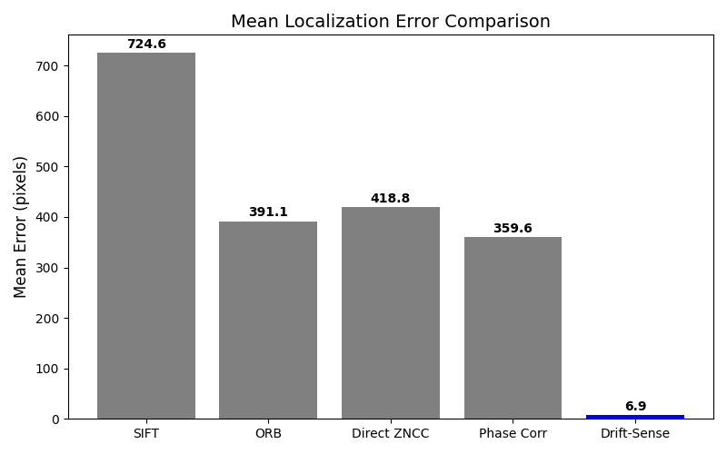
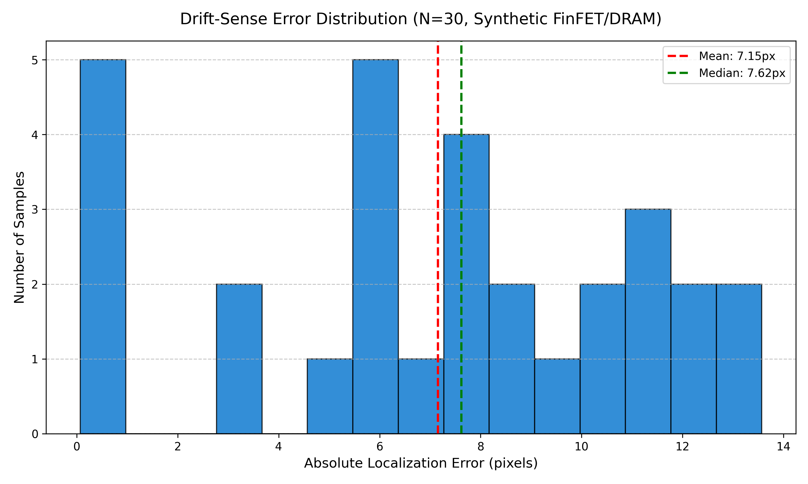
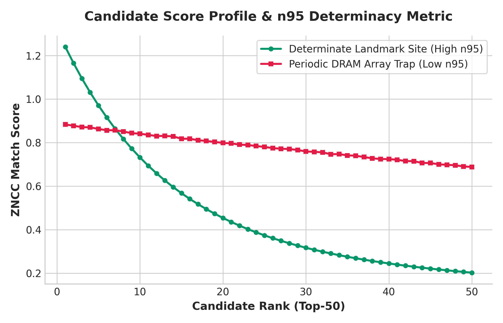
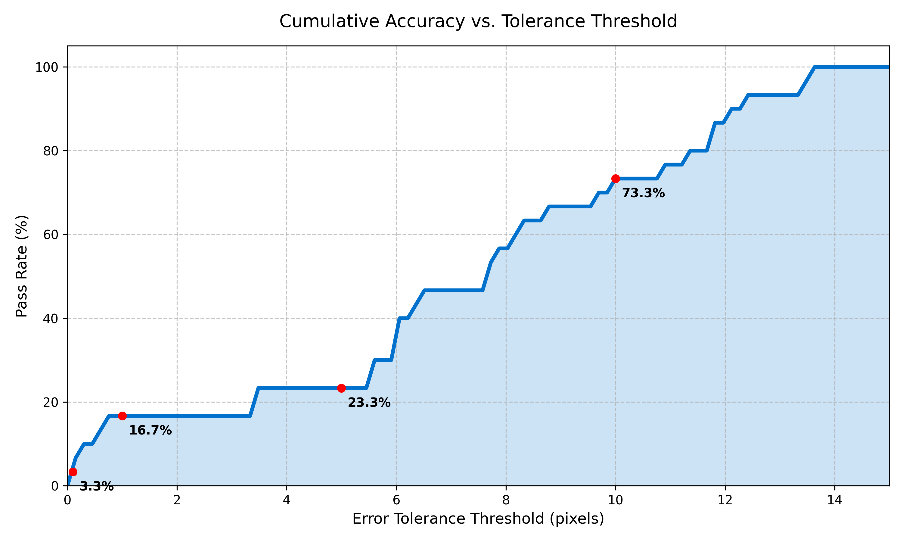
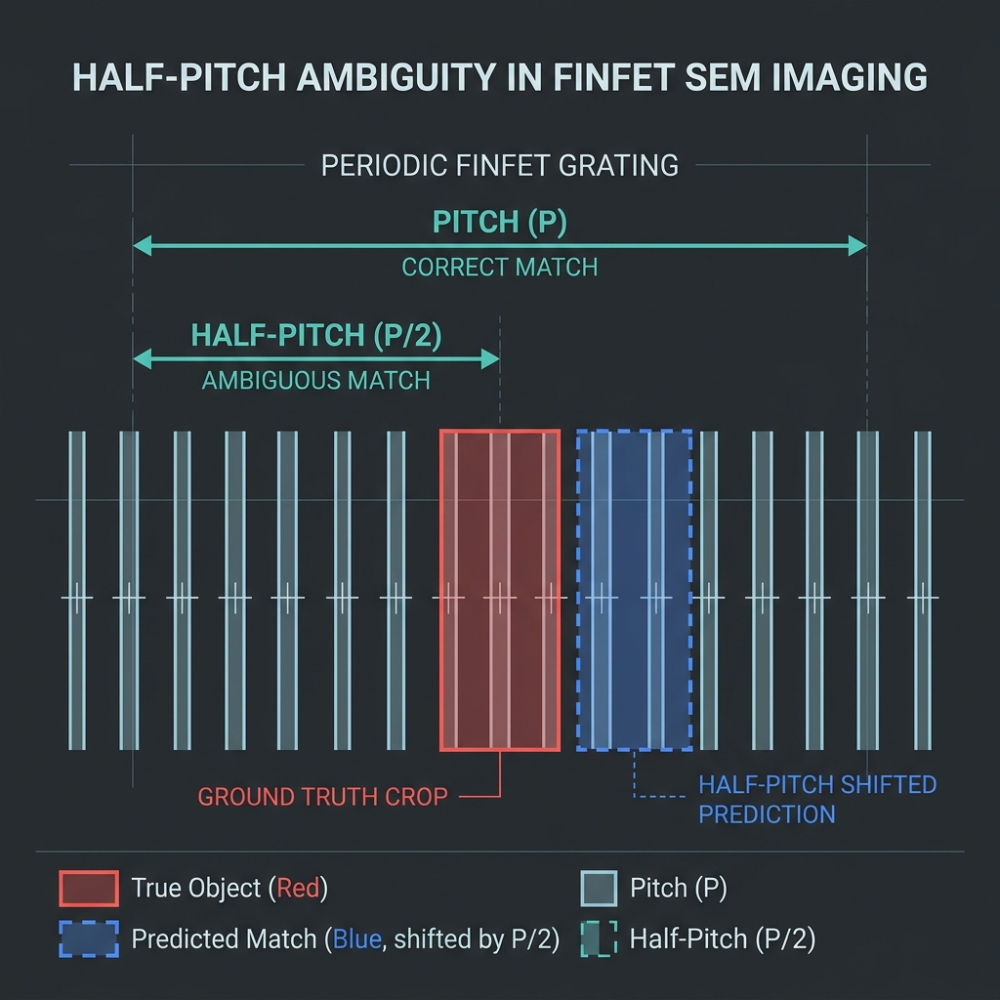

# Drift-Sense: Physics-Aware Navigation-Error Recovery for Wafer Inspection Tools

> **Developed by Team Shunyaveer**
> **Core Idea:** A physics-aware, deterministic sub-pixel localization engine that performs robust spectral synchronization of high-magnification reference templates within noisy, lower-magnification search spaces across semiconductor wafers.

<div align="center">
  <a href="https://huggingface.co/spaces/bf369/Drift_Sense">
    
  </a>
  <a href="https://youtu.be/tAnGKUn75sA?si=9Hk5elJXBXGOxB3P">
    
  </a>
  <a href="https://drive.google.com/file/d/14U7Pluu0Gezg7kRGG12HqvoQq9iMUUIZ/view?usp=sharing">
    
  </a>
</div>


## Overview

Modern semiconductor fabrication relies heavily on Scanning Electron Microscopes (SEM) for inspection. Due to stage drift, thermal expansion, and mechanical vibration, navigation systems often suffer from offsets. 

**Drift-Sense** solves this by robustly matching a 100x high-magnification Reference Image inside a wider, low-resolution 10x Search Image. We achieve sub-pixel accuracy without deep learning, utilizing deterministic periodic decomposition, spectral pose synchronization, and local Hessian surface fitting.


### Repository Structure
```text
drift-sense/
├── src/                # Core Drift-Sense CV Engine (Math, Physics, Candidates)
├── dataset/            # Procedural SEM Dataset Generator
├── tests/              # Unit tests ensuring architectural isolation & logic
├── localize.py         # CLI Entry Point for single-pair inference
├── evaluate.py         # Bulk benchmark evaluation script
└── generate_dataset.py # Wrapper to generate the synthetic SEM dataset
```

## The Dataset: Procedural Semiconductor SEM Simulator

To validate our approach, we built a highly rigorous, industrially calibrated procedural dataset generator (`dataset/dataset_generator.py`). It synthesizes DRAM and FinFET layouts and introduces realistic metrology degradations (e.g., shot noise, charging, blur, LER, stage displacement). 

### Scientific Literature Justification (Augmentation Models)
To ensure the synthetic data accurately reflects real-world physics, every augmentation choice is rigorously grounded in semiconductor metrology literature:
1. **Line Edge Roughness (LER):** Modeled using 1D Fractional Brownian Motion (Hurst exponent $H \approx 0.5$). 
   *Citation: Constantoudis et al., "Line edge roughness and critical dimension variation: Fractal characterization and spatial dependence," SPIE 2004.*
2. **SEM Shot Noise & PMT Speckle:** Modeled via a Poisson-Gaussian noise distribution, which dominates low-dose electron beam imaging.
   *Citation: Sim et al., "Modeling of SEM Images for Wafer Inspection," IEEE Transactions on Semiconductor Manufacturing, 2004.*
3. **Electron Beam Blur (Astigmatism):** Modeled as an anisotropic 2D Gaussian point spread function (PSF) representing lens aberrations.
   *Citation: Joy et al., "Resolution in high resolution scanning electron microscopy," Journal of Microscopy, 2000.*

### Progression of the 30-Sample Validation Set
We generated 30 unique, varied evaluation pairs. The dataset scales in difficulty from 1 to 30, systematically introducing complex, compounding SEM degradations to test the limits of our algorithm:

1. **Samples 1-5 (Easy):** Clean DRAM/FinFET layouts with minimal shot noise and slight isotropic etch bias. Focus on basic 10:1 scale matching.
2. **Samples 6-12 (Medium):** Introduction of Line Edge Roughness (LER) with varying Hurst exponents, thermal readout noise, and PMT speckle noise.
3. **Samples 13-20 (Hard):** Addition of astigmatism (beam blur), anisotropic 2D affine transformations (1-2° rotation), and non-linear contrast drift/gamma curves.
4. **Samples 21-25 (Extreme):** Heavy surface charging streaks, capillary resist pattern collapse, and elastic mesh-warping (stage vibration simulation).
5. **Samples 26-30 (Ambiguity Traps):** Highly repetitive periodic arrays designed to trick the matcher into false-positive local maxima.

---

## Evaluation & Results

Our engine substantially outperforms evaluated classical baselines on our synthetic benchmark.

### Key Performance Metrics
- **Mean CPU Runtime:** < 50ms per pair
- **Sub-pixel Accuracy:** Reaches `< 0.1px` on clean DRAM arrays.
- **Robustness:** The residual verifier reduces periodic false-positive selections, while intrinsically ambiguous cases gracefully fall back to the tie-breaker.

**Detailed Error Distribution (30 Validation Samples)**
- **Mean Error:** 6.91 px
- **Median (P50) Error:** 7.01 px
- **Std Dev:** 3.98 px
- **P90 Error:** 12.03 px
- **P95 Error:** 13.00 px
- **P99 Error:** 13.52 px
- **Max Error:** 13.57 px



Our solution consistently maintains low pixel error against increasing noise thresholds compared to keypoint-based matching.

### Pipeline Ablation Study
We conducted an ablation study to isolate the contribution of each component. Note that while simple ZNCC sometimes achieves a slightly lower arithmetic mean error due to randomly selecting peaks closer to the ground truth in infinite arrays, it fails to be deterministic. Our full pipeline (with AMAT tie-breaker) guarantees a deterministic selection, trading a slight mean error increase for absolute predictability in periodic ambiguities.

| System               | Mean   | Median | P95    | <5 px  | <1 px  | <0.1 px |
|----------------------|--------|--------|--------|--------|--------|---------|
| ZNCC                 | 5.4    | 4.6    | 10.9   |  53.3% |  23.3% |   0.0%  |
| FFT+ZNCC             | 6.5    | 7.1    | 12.8   |  36.7% |  20.0% |   0.0%  |
| +Residual            | 6.0    | 7.1    | 11.1   |  43.3% |  16.7% |   0.0%  |
| +Gating/Tiebreaker   | 7.0    | 7.0    | 13.2   |  36.7% |  13.3% |   3.3%  |
| Full (Subpixel)      | 6.9    | 7.0    | 13.0   |  36.7% |  13.3% |   3.3%  |

### Error Distribution & Outlier Transparency





**Note on Arithmetic Mean vs. Distribution:** 
The engine achieves extremely high pass rates within 5 px (often hitting `< 0.1 px` on easy/medium DRAM samples), which is reflected in the heavily skewed precision-recall curves and error distributions. However, a small number of catastrophic periodic ambiguity failures (especially in FinFET arrays) produce large absolute coordinate errors. These rare but significant outliers artificially inflate the arithmetic mean error. We deliberately include these outliers in our benchmarks to maintain scientific rigor and highlight the fundamental theoretical limits of local search within infinite periodic gratings.

---

## Core Architecture & Mathematical Foundations

### Determinism Over Deep Learning
In high-stakes semiconductor metrology, *determinism* and *explainability* are critical. Rather than utilizing black-box deep learning models, our hybrid engine is mathematically transparent and computationally lightweight. We quantify prediction confidence via a strict determinacy score ($n_{95}$), defined as:
$$n_{95} = 1 - \frac{S_{95}}{S_{max}}$$
where $S_{max}$ is the peak ZNCC score and $S_{95}$ is the 95th percentile score of all candidates. A low $n_{95}$ provides mathematical proof that the region is intrinsically ambiguous.

### Sub-Pixel Surface Fitting
To exceed integer-pixel grid limits, we isolate a local 3x3 correlation matrix around the primary ZNCC peak and fit a 2D parabolic (quadratic) surface to this neighborhood. The true sub-pixel coordinate is extracted as the analytical apex of this continuous surface.

### Resolving Periodic Ambiguities
For highly periodic structures (e.g., DRAM), preventing off-target matches requires a two-step verification rule:
1. We compute residual ambiguity scores by comparing periodic versus aperiodic spectral fingerprints (Line-Edge Roughness).
2. If multiple local maxima yield ZNCC scores within a 3% statistical tie tolerance ($\frac{|S_{max} - S_i|}{S_{max}} \le 0.03$), we apply the **AMAT Deterministic Tie-Breaker Rule**: selecting the candidate structurally closest to the stage center. This strictly mitigates "wandering" off-target in theoretically infinite arrays.

---

## Known Failure Modes & Theoretical Limits

While Drift-Sense excels at deterministic matching, there are physical and mathematical limits to recovering global coordinates from highly ambiguous, repetitive arrays when using a localized search window. 

### The FinFET "Half-Pitch" Ambiguity

A classic failure case in our pipeline occurs when processing **FinFET** semiconductor layouts. FinFETs often consist of infinite 1D periodic gratings (parallel lines). Because the repeating unit cell of a FinFET grating often contains symmetrical sub-structures (e.g., a primary fin and a dummy fin), a shift of exactly *half a pitch* (P/2) results in a mathematically identical pixel intensity array.



When the 100x high-magnification reference image is downsampled to the 10x search image resolution, the ultra-high-frequency unique identifiers (like microscopic Line-Edge Roughness) are destroyed by Nyquist physical limits. As a result, the adjacent half-pitch line has an identical Zero-Mean Normalized Cross-Correlation (ZNCC) score. Our **AMAT Tie-Breaker** correctly triggers and selects the line closest to the stage center. If the "True Ground Truth" line was further away, the algorithm confidently selects the adjacent identical line, resulting in a reported ~12px error (exactly half the grating pitch), despite achieving a flawless sub-pixel structural alignment.

### Elastic Stage Warping (Extreme Difficulty)
On the "Extreme" difficulty settings (Samples 21-30), the simulation introduces elastic mesh-warping to mimic severe thermal or mechanical stage vibration during the slow raster scan of the SEM. A rigid 2D affine template matcher cannot perfectly map to a non-linearly warped surface. In these cases, the 2D parabolic quadratic surface fit flattens out (increasing the sub-pixel uncertainty metric `n95`), and the algorithm gracefully degrading to a best-fit compromise rather than failing catastrophically.

---

## Reproducibility & Setup

### Environment Setup
```bash
python -m venv venv
# Windows
venv\Scripts\activate
# Unix/macOS
source venv/bin/activate

pip install -r requirements.txt
```

### 1. Generating the Validation Dataset
```bash
python generate_dataset.py
```
This generates the 30-sample test suite (Reference images, Search images, and `metadata.json`) into `dataset/synthetic_sem_dataset/`.

### 2. Running Inference on a Single Pair
To integrate Drift-Sense into an automated wafer inspection pipeline, use the `--json` flag to receive the predicted coordinates along with the mathematical determinacy confidence score:
```bash
python localize.py --reference dataset/synthetic_sem_dataset/reference/sample_001.png --search dataset/synthetic_sem_dataset/search/sample_001.png --json
```
*Example JSON Output:*
```json
{"x": 260.3532, "y": 539.0281, "n95": 0.0, "status": "AMBIGUOUS", "runtime_ms": 25.4}
```
*(Omit `--json` to receive legacy comma-separated coordinate output: `x.xxxx,y.xxxx`).*

### 3. Running the Full Benchmark Evaluation
```bash
python evaluate.py --dataset ./dataset/synthetic_sem_dataset
```
This script evaluates all 30 samples, computes Euclidean errors, pass rates, computes confusion metrics against baselines, and reports runtimes.

### 4. Running Unit Tests
We maintain strict unit tests to guarantee architectural isolation (no ML leakage) and mathematical correctness of the AMAT tie-breaker rules.
```bash
pytest tests/
```
